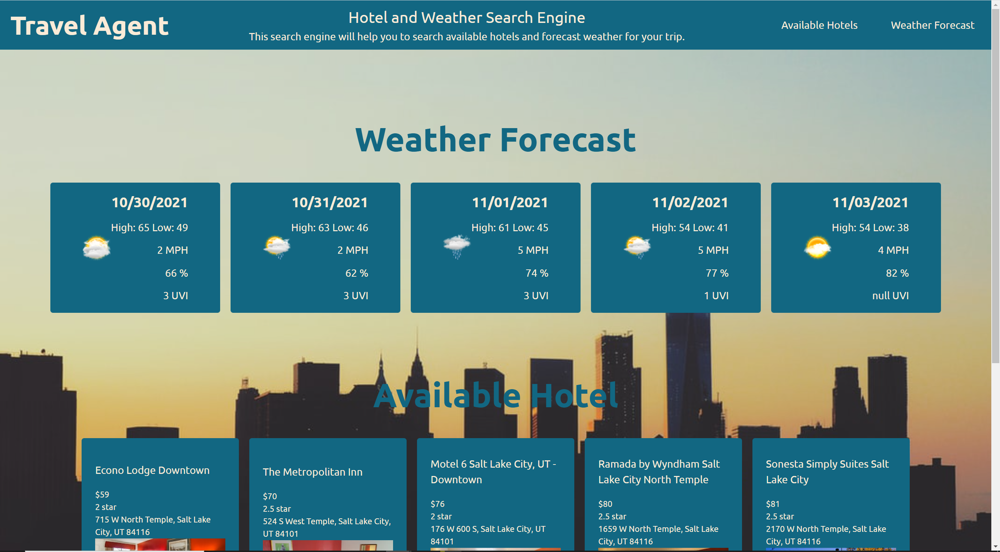
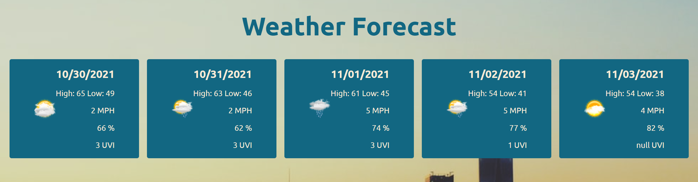
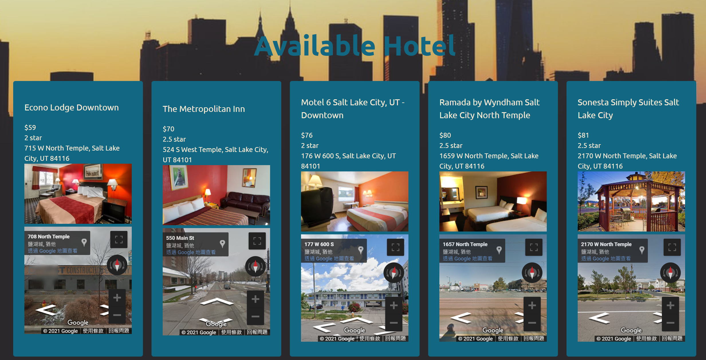
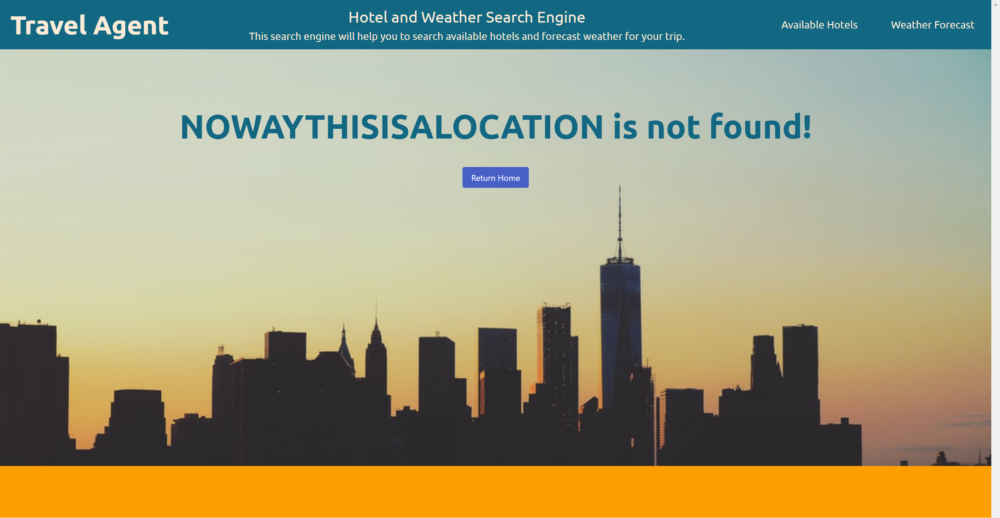
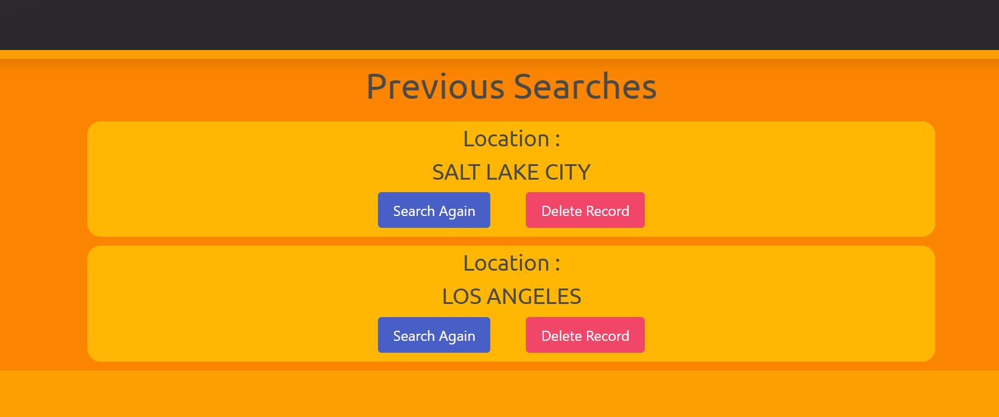

## travel-agent

## Description 

User can input their trip destination. The application will then search available hotels with their price in the area.
The application will also search the 5 day forecast weather of the area.

## Technologies used 

Hotel Pricing API:

Name : Hotels

Creator : Api Dojo

Link : https://rapidapi.com/apidojo/api/hotels4/

Geocoding API

Name : OpenWeatherMap

Creator : OpenWeather

Link : https://openweathermap.org/

Weather API

Name : AerisWeather

Creator : AerisWeather

Link - https://rapidapi.com/aerisweather-aerisweather/api/aerisweather1/

## Screenshot

WireFrame

Index WireFrame

Hotel WireFrame

Application ScreenShots

The Application will first start on the index.html.

If it is the first time user use this application, the lower part of the page will display no previous search.

If user put in empty string for searching, error message will be displayed.

Otherwise, user will be redirected to hotel.html for search result.

The Application sometimes takes awhile before all information is prepared.

The 5 day weather forecast will be display on the top part of the page.

The hotel result will be display on the lower part of the page.

If the location is not found, error message and return button will be displayed.

After any successful search, when user revisit index.html, the previous search history will be updated.

## Link to deployed application

Application Link : https://maxh1231.github.io/travel-agent/

Repository Link : https://github.com/maxh1231/travel-agent
