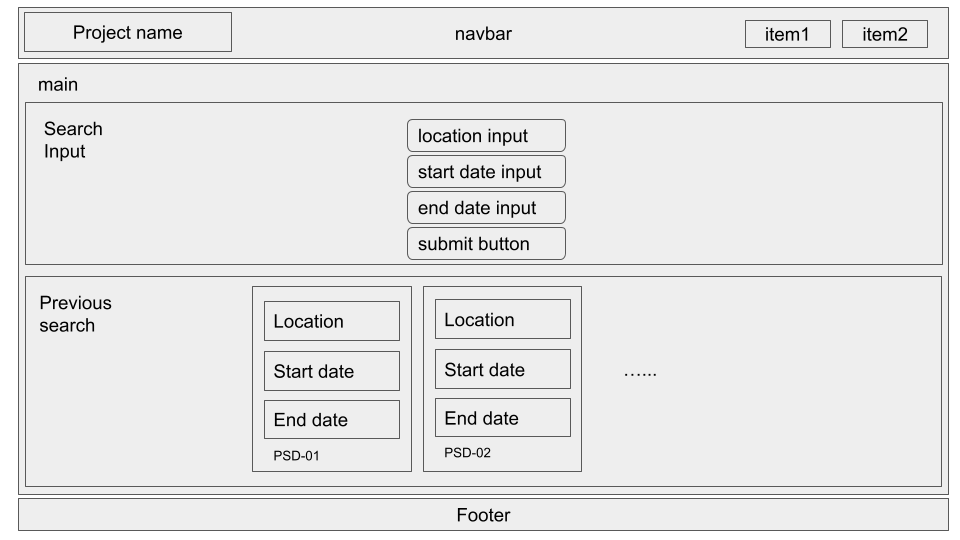
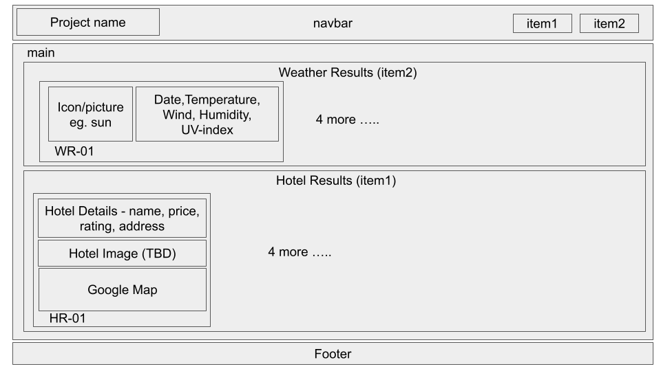
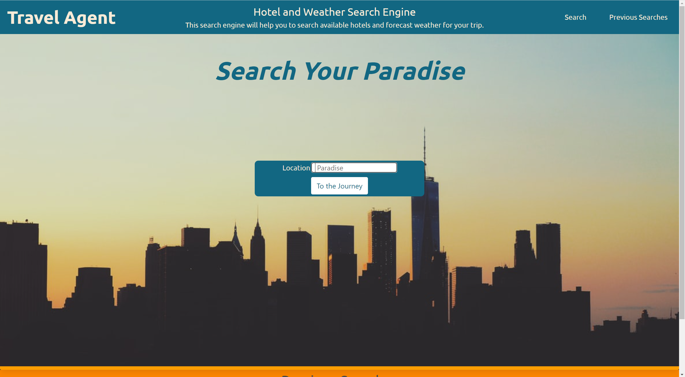

## travel-agent

## Description 

User can input their trip destination. The application will then search available hotels with their price in the area.
The application will also search the 5 day forecast weather of the area.

## Technologies used 

Hotel Pricing API:

Name : Hotels

Creator : Api Dojo

Link : https://rapidapi.com/apidojo/api/hotels4/

Weather API

Name : Dark Sky

Creator : Dark Sky

Weather API - https://rapidapi.com/darkskyapis/api/dark-sky/

## Screenshot

WireFrame

Index WireFrame

Hotel WireFrame

Application ScreenShots

The Application will first start on the index.html.

The Application will display the search result on the hotel.html.

## Link to deployed application

Application Link : https://maxh1231.github.io/travel-agent/
